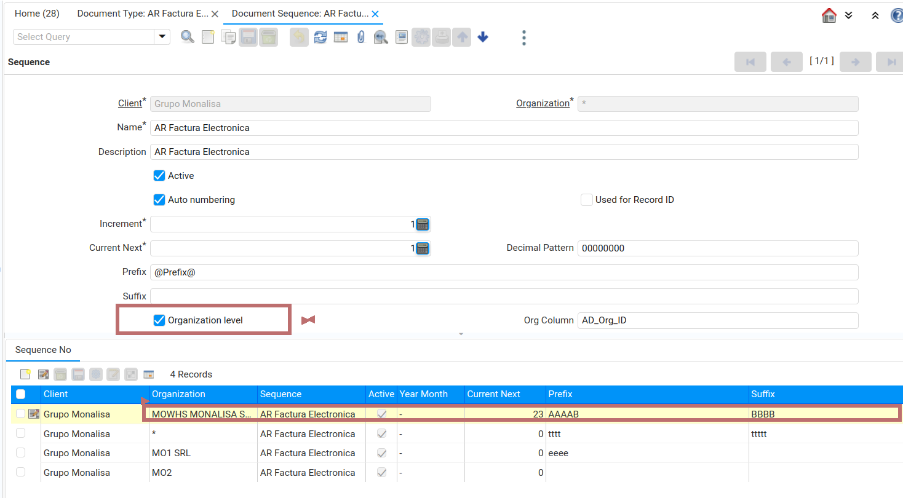

&lArr;[MONALISA PLUGINS](../README.md) | [Home](../README.md)
<br />
<div align="center">
  <a href="MONALISA_LOGO">
    
  </a>
</div>

<a name="readme-top"></a>

# MONALISA Document Plugin

## <b>Description</b>

Monalisa Document Plugin is related to Business Logic applied to Documents.


<a name="readme-top"></a>


<b>Content:</b>


| Item  | Description                                    | Table             
| ----: | ---------------------------------------------- | -----------------
|     1 | [Invoices ](#step1)                			 | C_Invoice  
|     2 | [Payments ](#step2)                | C_Payment 
|     3 | [Inventory Movements ](#step3)              | M_InOut 

## <a name="step1"></a>⭐️1 <b>Invoices</b>

```text
- Document Sequence by Organization
```


####  Document sequence by organization.

This feature provides Sequence number to be build using Prefix and Suffix .
These Prefix and Suffix are defined by each Organization.

Sequence number sample  PREFIX<Current Next>SUFFIX

<div align="center">
  <a href="AMERPSOFT_logo">
    
  </a>
</div>


<p align="left">(<a href="#readme-top">back to top</a>)</p>

##  <a name="step2"></a>⭐️2.<b>Payments</b>
This feature ..

<p align="left">(<a href="#readme-top">back to top</a>)</p>


## <a name="step2"></a>⭐️3.<b>Inventory Movements</b>

This feature ..

<p align="left">(<a href="#readme-top">back to top</a>)</p>
